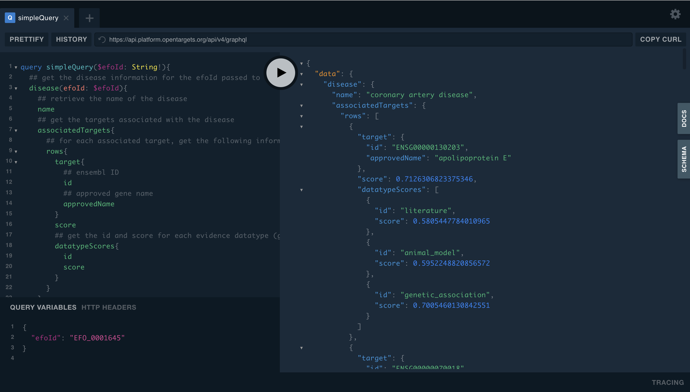

```{r, echo = FALSE, include = FALSE}
knitr::opts_chunk$set(python.reticulate = FALSE)
library(knitr)
library(kableExtra)
style <- function(df){
  df %>% kable(digits = 2) %>% kable_styling(bootstrap_options = c("condensed"))
}

```

Open Targets is a public-private partnership for systematic identification, prioritisation, and validation of drug targets. In this three-part blog post series, I will give an overview of Open Targets, the data available, and how to access it through the web interface, programmatically through the APIs, and using the data downloads. 

<!--more-->

Open Targets is a public-private partnership for systematic identification, prioritisation, and validation of drug targets. In this three-part blog post series, I will give an overview of Open Targets, the data available, and how to access it through the web interface, programmatically through the APIs, and using the data downloads. 

As a postdoc at the [Centre for Medicines Discovery](https://www.cmd.ox.ac.uk/) (University of Oxford) and [UK SPINE](https://www.kespine.org.uk/), I was working with Open Targets to identify potential drug development opportunities for age-related multimorbidities. We were interested in finding genes associated with a number of age-related diseases, dissecting the genetic evidence for those relationships, and assessing the novelty and tractability of these targets as potential drug targets. Luckily for me, the team at Open Targets have already spent several years thinking about exactly these problems. In these blog posts, I will try to distil everything I learnt during these months of privileged insider access to the Open Targets slack channels about how to use their platform and how to scale up as my queries got more and more demanding. 

### Overview 

There are two main resources: [**Open Targets Platform**](https://platform.opentargets.org/), which integrates public domain data to enable target identification and prioritisation, and [**Open Targets Genetics Portal**](https://genetics.opentargets.org/), which focuses on genome-wide association and functional genomics data. 

In brief, **Open Targets Platform** takes the best bits from a huge range of biological data resources, as well as internally generated data, and curates it as "evidence" to make connections between "targets" (a protein, protein complex, or RNA molecule) and "diseases" (Experimental Factor Ontology (EFO) terms). For example, an approved drug in ChEMBL with a known indication - the disease - and a known mechanism of action - the target - provides a piece of evidence that the target and disease are associated. All the evidence linking a target and disease is summarised as a target-disease "association", with a score ranging from 0-1. 

**Open Targets Genetics** aggregates human GWAS and functional genomics data to enable large-scale exploration and prioritisation of potential causal variants and genes. It calculates an in-house disease-agnostic Variant-to-Gene (V2G) mapping and a disease-specific Locus-to-Gene (L2G) mapping for trait-associated loci, with both methods using a score ranging from 0-1. It also enables systematic comparisons between studies, providing the number of shared independently-associated loci between studies, and performing pairwise colocalisation analysis.

### Platform and Genetics Portal: Which should I use?

Do you want to know all the targets genetically implicated in a disease? All the drugs that target your protein of interest? You want **Open Targets Platform** for that. 

Want to explore potential causal genes for an interesting GWAS hit? The genetic overlap between two different traits? You want **Open Targets Genetics** for that. 

Want to know the best most promising and tractable novel target for your disease of interest? Well actually, you have to decide that for yourself (sorry), but the **Platform** and **Genetics Portal** can help. 

## Accessing the data

The resources can be explored through rich web interfaces, API queries, or data downloads. I've accessed data in the Platform and Genetics Portal just about every way there is (BigQuery is the final hurdle, [don't ask me about that](https://platform-docs.opentargets.org/data-access/google-bigquery)). My main piece of advice is this: if you are confused or don't know how to get what you want, ask them. Seriously! Your problem will be solved and you will wonder why you spent a week trying to work it out yourself. The Open Targets team are extremely helpful (and patient) - and they like finding out all the weird and creative ways people are using their data to answer biological questions. You can also join the newly-created [Open Targets Community](https://community.opentargets.org/) to see how other people are using the Platform and Genetics Portal, to get technical support from the team, and to get the latest updates from Open Targets.

### Browsing the web interface

The web interface is a great place to start for exploring specific diseases, targets, or hypotheses. I recommend having a browse to get a sense of the kind of data that is available. You can find more details about the web interface in the [documentation](https://platform-docs.opentargets.org/web-interface). 

You'll probably want to go here when following up on interesting things that you find, and you can easily access an individual entity (target, disease, variant, GWAS) or target-disease association evidence via URL. It's easy to generate these programmatically using the relevant ID codes for genes/targets (ENSEMBL IDs e.g. `ENSG00000130203`), diseases (EFO codes, e.g. `EFO_0001645`), GWAS studies (e.g. `GCST005194`) and variants (e.g. `19_44908822_C_T`). For example:

* Target profile (protein information, pathways, tractability, baseline expression, etc): [https://platform.opentargets.org/**target**/**ENSG00000130203**](https://platform.opentargets.org/target/ENSG00000130203)

* Disease associations for a target: [https://platform.opentargets.org/target/ENSG00000130203/**associations**](https://platform.opentargets.org/target/ENSG00000130203/associations)

* Evidence linking a target to a disease: [https://platform.opentargets.org/**evidence**/**ENSG00000130203**/**EFO_0001645**](https://platform.opentargets.org/evidence/ENSG00000130203/EFO_0001645)

* Gene summary (associated studies for a given gene): [https://genetics.opentargets.org/**gene**/**ENSG00000130203**](https://genetics.opentargets.org/gene/ENSG00000130203)

* Study summary (associated loci, lead variants, linked genes): [https://genetics.opentargets.org/**study**/**GCST005194**](https://genetics.opentargets.org/study/GCST005194)

* Variant summary (variant details, assigned genes, PheWAS, linked variants): [https://genetics.opentargets.org/**variant**/**19_44908822_C_T**](https://genetics.opentargets.org/variant/19_44908822_C_T)

* Association summary (gene prioritisation, colocalisation, credible set overlap): [https://genetics.opentargets.org/**study-locus**/**GCST005194**/**19_44908822_C_T**](https://genetics.opentargets.org/study-locus/GCST005194/19_44908822_C_T)

### API access using GraphQL

In the revamped version of the Platform [released at the end of April](http://blog.opentargets.org/2021/04/29/next-gen-platform-released/), the web interface has been redesigned, and the data has been completely restructured to use a GraphQL API that replaces the previous REST API. The Genetics Portal also uses a GraphQL API. 

If you haven't used a GraphQL API before, you're going to love it. You get exactly the data you request (with no unwanted extras) in a predictable format. The graph representation feels natural for this kind of data, and your queries can traverse the graph, meaning that you can achieve in a single query what would have taken multiple separate queries using the REST API. 

For example, you can say: I want all the targets that are co-mentioned in the literature with my disease of interest (i.e. EuropePMC literature evidence), AND, for each target, I want to know its gene symbol, the sentence from the paper, and whether there are any drugs approved or in clinical trials that act on this target (from ChEMBL). 😮No need to ever read a paper manually again! (That's a joke) 

#### Querying through the interactive browsers

The Platform and Genetics Portal have separate APIs. The interactive GraphQL browsers, which include autocomplete and documentation, are useful for exploring the data, getting to know the schemas, and testing out queries:

* **Platform Browser**: https://api.platform.opentargets.org/api/v4/graphql/browser
* **Genetics Portal Browser**: https://api.genetics.opentargets.org/graphql/browser  

I recommend reading [this previous blog post](http://blog.opentargets.org/2020/08/06/accessing-the-open-targets-genetics-using-graphql/) for a detailed overview of how to construct GraphQL queries and use the GraphQL browser. 

Briefly, construct a query by including the relevant fields you want to query (e.g. `disease` to get information about a disease, or `target` for information about a target) and which of the available subfields that you're interested in retrieving from that field  (e.g. `name` or `associatedTargets`). 

You also need to pass your variables to the query. You can either hardcode these in the query (e.g. `(efoId: "EFO_0001645")`) or, as in the example below, declare the variable type that will be passed to the query, in this case `$efoId: String!`. We can then include the variables in the "query variables" window at the bottom of the browser.   

For example, say I'm interested in finding targets associated with [Coronary Artery Disease](https://platform.opentargets.org/disease/EFO_0001645/associations):

Here's a query that will do that, which you can execute in the interactive browser:

```{bash, eval = FALSE}
# Query
query simpleQuery($efoId: String!){
  ## get the disease information for the efoId passed to the query
  disease(efoId: $efoId){
    ## retrieve the name of the disease 
    name
    ## get the targets associated with the disease
    associatedTargets{
      ## for each associated target, get the following information
      rows{
        target{
          ## ensembl ID
          id
          ## approved gene name
          approvedName
        }
        ## the overall association score between the target and disease
        score
        ##  the id and score for each evidence datatype (genetic, literature, etc)
        datatypeScores{
          id
          score
        }
      }
    }
  }
}
```

In order to execute the query, include the disease we want to query in the "Query Variables" window and press the big button. 

```{bash, eval = FALSE}
{
  "efoId": "EFO_0001645"
}

```

Here's the first result in the output, which shows us the top hit is APOE with an overall association score of 0.71, based on evidence from literature, animal models (PhenoDigm) and genetic associations. 

```{bash, eval = FALSE}
# Output
{
  "data": {
    "disease": {
      "name": "coronary artery disease",
      "associatedTargets": {
        "rows": [
          {
            "target": {
              "id": "ENSG00000130203",
              "approvedName": "apolipoprotein E"
            },
            "score": 0.7126306823375346,
            "datatypeScores": [
              {
                "id": "literature",
                "score": 0.5805447784010965
              },
              {
                "id": "animal_model",
                "score": 0.5952248820856572
              },
              {
                "id": "genetic_association",
                "score": 0.7005460130842551
              }
            ]
          }
        ]
      }
    }
  }
}

```


Here's how it looks in the interactive browser:



What's great about GraphQL is that you can ask for information very flexibly. For example, if I want to know more about the targets associated with Coronary Artery Disease, I can just add more fields to the `target` query. 

The following query will retrieve information about the subcellular location, tractability, and protein expression levels in different tissues, for all targets associated with Coronary Artery Disease:

```{bash, eval = FALSE}
# Query with annotations
query simpleQuery($efoId: String!){
  disease(efoId: $efoId){
    name
    associatedTargets{
      rows{
        target{
          id
          approvedName
          ## retrieve annotations for subcellular locations
          proteinAnnotations{
            subcellularLocations
          }
          ## predicted small molecule tractability
          tractability{
            smallmolecule{
              topCategory
            }
          }
          ## protein expression levels in different cell types
          expressions{
            protein{
              cellType {
                name
                level
                reliability
              }
            }
          }
        }
        datatypeScores{
          id
          score
        }
      }
    }
  }
}

# Query variables
{
  "efoId": "EFO_0001645"
}
```

**Output:**

```{bash, eval = FALSE}
{
  "data": {
    "disease": {
      "name": "coronary artery disease",
      "associatedTargets": {
        "rows": [
          {
            "target": {
              "id": "ENSG00000130203",
              "approvedName": "apolipoprotein E",
              "proteinAnnotations": {
                "subcellularLocations": [
                  "Secreted",
                  "Extracellular space",
                  "Extracellular matrix"
                ]
              },
              "tractability": {
                "smallmolecule": {
                  "topCategory": "Discovery_Precedence_sm"
                }
              },
              "expressions": [
                {
                  "protein": {
                    "cellType": [
                      {
                        "name": "adipocytes",
                        "level": 0,
                        "reliability": true
                      }
                    ]
                  }
                },
                {
                  "protein": {
                    "cellType": [
                      {
                        "name": "glandular cells",
                        "level": 3,
                        "reliability": true
                      }
                    ]
                  }
                },
## output truncated ##

```
 

As GraphQL queries consist of just a string, you can execute the query programmatically in whatever language you feel like.

#### Querying through the command line

You can execute queries on the command line using curl. For example, you can save your query and variables in separate files (e.g. `query.gql` and `variables.gql`), and use a script to perform the execution:

`./otpql.sh query.gql variables.gql > output.json` 

Where `otpql.sh` is a script like the following (which you should not have to modify):

```{bash, eval=FALSE}
#!/usr/bin/env bash

# Modified from MatrixManAtYrService stackoverflow answer
# https://stackoverflow.com/questions/42021113/how-to-use-curl-to-access-the-github-graphql-api

if [ ! -f $1 ]
then
    echo Queries the Open Target Platform GraphQL API
    echo "Usage:"
    echo
    echo "$0 somequery.gql somevariables.gql"
fi

# read the gql query from the file named in the argument
QUERY=$(jq -n \
           --arg q "$(cat $1 | tr -d '\n')" \
           --arg v "$(cat $2 | tr -d '\n')" \
           '{ query: $q, variables: $v}')

# do the query
curl -X POST \
  -H "Content-Type: application/json" \
  --data "$QUERY" \
  https://api.platform.opentargets.org/api/v4/graphql

```

The output will be be returned as a single line in JSON format, which you can explore on the command line using a tool like [jq](https://stedolan.github.io/jq/) (see my [previous blog post](https://clarewest.github.io/blog/post/handling-json-data-with-jq/) for examples of how to use jq).


#### Querying programmatically using R

Alternatively, you can execute queries in R using the packages `ghql` for handling the GraphQL queries, and `jsonlite` to process the JSON output. 

```{r, results = "hide", message = FALSE, warning = FALSE}
library(dplyr)
library(ghql)
library(jsonlite)

## Set up to query Open Targets Platform API
otp_cli <- GraphqlClient$new(url = 'https://api.platform.opentargets.org/api/v4/graphql')
otp_qry <- Query$new()

## Query for targets associated with a disease
otp_qry$query('simple_query', 'query simpleQuery($efoId: String!){
  disease(efoId: $efoId){
    name
    associatedTargets{
      rows{
        target{
          id
          approvedName
        }
        score
        datatypeScores{
          id
          score
        }
      }
    }
  }
}'
)

## Execute the query
variables <- list(efoId = 'EFO_0001645')
result <- fromJSON(otp_cli$exec(otp_qry$queries$simple_query, variables, flatten = TRUE))$data$disease

```

Note that the output will be nested, so you may want to reshape the data a bit:

```{r}
top_targets <- 
  as.data.frame(result$associatedTargets$rows) %>% 
  flatten() %>% 
  rename(overallScore = score) %>% 
  tidyr::unnest(datatypeScores) %>% 
  tidyr::pivot_wider(names_from = "id", values_from = "score")

```

```{r, echo = FALSE}
print(top_targets, digits = 1)

```

#### What kind of information can I get from the Platform and the Genetics Portal?

In Part 2 of this blog post series, I'll go into more detail about the data available and give some particular examples of how you can explore the genetic evidence linking targets and diseases. 

#### What if I want to know EVERYthing?

If you're interested in querying more than a few targets or diseases, or if you want to use the full range of data and annotations Open Targets has to offer, it's time to think about using the data downloads: see Part 3 for examples of how you can efficiently query a local copy of Open Targets. 

#### Post-script

Oh, and that query I promised would save you having to read papers?

```{bash, eval = FALSE}
query literatureDrugQuery($efoId: String!) {
  disease(efoId: $efoId) {
    name
    associatedTargets(
      aggregationFilters: [{ name: "dataTypes", path: "literature" }]
    ) {
      rows {
        score
        target {
          id
          approvedSymbol
          evidences (
            efoIds: [$efoId]
            datasourceIds: ["europepmc"]
          ){
            count
            rows {
              textMiningSentences {
                text
              }
            }
          }
                    knownDrugs {
            uniqueDrugs
            rows {
              drug {
                id
                name
                maximumClinicalTrialPhase
              }
            }
          }
        }
      }
    }
  }
}

```


