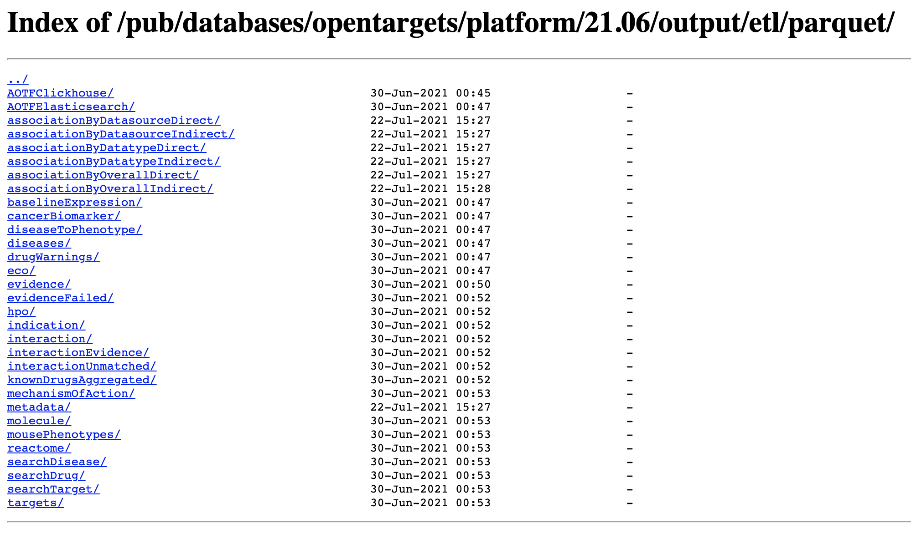
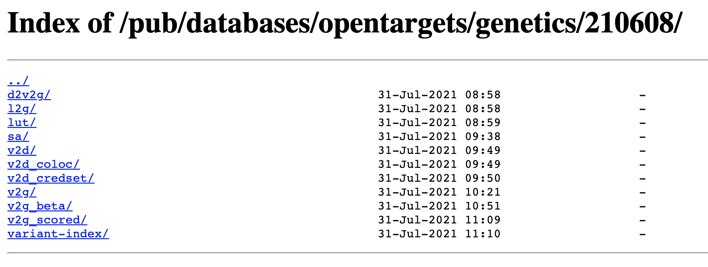

Now we've covered [the basics of Open Targets](https://clarewest.github.io/blog/post/crash-course-in-open-targets-part-1/) and [dug deeper into the evidence](https://clarewest.github.io/blog/post/crash-course-in-open-targets-part-2/) that makes up the data, this final part of the crash course covers how to harness it at a bigger scale through the data downloads.

<!--more-->

Now we've covered [the basics of Open Targets](https://clarewest.github.io/blog/post/crash-course-in-open-targets-part-1/) and [dug deeper into the evidence](https://clarewest.github.io/blog/post/crash-course-in-open-targets-part-two/) that makes up the data, this final part of the crash course covers how to harness it at a bigger scale through the data downloads.

For one whole year I happily hammered away at the APIs, but my queries kept getting bigger and more complex and eventually I wanted to use just about every piece of data that Open Targets provides. The Open Targets team finally told me (to paraphrase): "Clare, it's time to grow up, the APIs aren't designed for what you're doing, use the data downloads instead". 

At first I was hesitant about handling big confusing files on my little laptop, but they were right - it was a lot easier and it only took me one day to figure it out. I've had no trouble querying these large datasets on my 8GB RAM laptop. Sadly, I have had to cancel my plans to crowdsource a new MacBook Pro.

## Data Downloads

I really recommend using using the [data downloads](https://platform.opentargets.org/downloads) for Open Targets Platform if you are querying more than a few targets or diseases, especially if you are interested in lots of the annotations. While the Platform is extremely comprehensive, the data itself is not terribly big (<6GB) - you can easily download the whole thing, or selectively download just the data of interest. 

The downloads are available [via FTP](http://ftp.ebi.ac.uk/pub/databases/opentargets/platform/) in JSON and parquet format, and you can find download instructions and usage examples in Python and R [here](https://platform-docs.opentargets.org/data-access/datasets). For more examples of how to use the data, check out [Open Targets Community](https://community.opentargets.org/).



For the Genetics Portal, the data is [available to download](https://genetics-docs.opentargets.org/technical-pipeline/data-download) in JSON format [via FTP](https://ftp.ebi.ac.uk/pub/databases/opentargets/genetics/). It's a lot bigger than the Platform - there are a few million variants after all - but you can always download specific parts of the data that you're interested in processing yourself, and supplement it with API calls. For example, locally I have the directories:

- `lut`: look-up tables, containing details on genes, studies, variants, and study-study overlaps
- `v2d`: [variant-to-disease](https://genetics-docs.opentargets.org/our-approach/assigning-traits-to-loci) information i.e. GWAS study, variant, effect size, p-value, the trait for the study and the EFO disease codes it was mapped to, etc
- `v2d_coloc`:  results of the [colocalisation analysis](https://genetics-docs.opentargets.org/our-approach/colocalisation-analysis) performed between GWAS and eQTL/pQTL studies, as well as between pairs of GWAS studies with overlapping hits

(that's 60GB of my laptop dedicated to the Genetics Portal, but I am a superfan).



## Fast data access and querying using Spark

Apache Spark is a superfast way to read and interact with the data downloads, and there are Spark interfaces available for Python ([PySpark](https://spark.apache.org/docs/latest/api/python/index.html)) and R ([sparklyr](https://spark.rstudio.com/)). If you're used to functional programming, for example using the `tidyverse`, `pandas`, or querying SQL databases, then handling data using Spark should feel relatively familiar.

First, if you don't already have it, you have to [install Spark and PySpark](https://spark.apache.org/docs/latest/api/python/getting_started/index.html) (this is the hard part). 

### Reading in the data

Here's an example of reading in Open Targets Platform data in Python using PySpark:

```{python, eval = FALSE}
import pyspark
from pyspark.sql import SparkSession
from pyspark.sql.functions import col, explode

## Set up Spark
sc = pyspark.SparkContext()
spark = SparkSession.builder \
           .getOrCreate()

## Data paths
ot_platform = "path/to/platform/data/21.06/"
ot_genetics = "path/to/genetics/data/210608/"

## Read Open Targets platform data 
diseases = (spark.read.parquet(ot_platform+"diseases/", header=True)
            .withColumnRenamed("id","diseaseId")
            .withColumnRenamed("name","diseaseName")
            )
targets = (spark.read.parquet(ot_platform+"targets/")
           .withColumnRenamed("id","targetId")
           .withColumnRenamed("approvedSymbol", "targetSymbol")
           .withColumnRenamed("approvedName","targetName")
           )
evidence = spark.read.parquet(ot_platform+"evidence")
knowndrugs = spark.read.parquet(ot_platform+"knownDrugsAggregated")
overall_associations = spark.read.parquet(ot_platform+"associationByOverallIndirect")

## Read Open Targets Genetics Portal data
studies = spark.read.json(ot_genetics+"lut/study-index")
v2d = spark.read.json(ot_genetics+"v2d/")
coloc = spark.read.json(ot_genetics+"v2d_coloc/")

```

(Note that I rename some columns to make it easier to join them together later)

### Inspecting available fields

You can use `.printSchema()` to explore the data available for each dataframe. Let's have a look at the fields for known drugs:

```{python, eval = FALSE}
knowndrugs.printSchema()
root
 |-- drugId: string (nullable = true)
 |-- targetId: string (nullable = true)
 |-- diseaseId: string (nullable = true)
 |-- phase: long (nullable = true)
 |-- status: string (nullable = true)
 |-- urls: array (nullable = true)
 |    |-- element: struct (containsNull = true)
 |    |    |-- niceName: string (nullable = true)
 |    |    |-- url: string (nullable = true)
 |-- ancestors: array (nullable = true)
 |    |-- element: string (containsNull = true)
 |-- label: string (nullable = true)
 |-- approvedSymbol: string (nullable = true)
 |-- approvedName: string (nullable = true)
 |-- targetClass: array (nullable = true)
 |    |-- element: string (containsNull = true)
 |-- prefName: string (nullable = true)
 |-- tradeNames: array (nullable = true)
 |    |-- element: string (containsNull = true)
 |-- synonyms: array (nullable = true)
 |    |-- element: string (containsNull = true)
 |-- drugType: string (nullable = true)
 |-- mechanismOfAction: string (nullable = true)
 |-- targetName: string (nullable = true)
```

### Filtering associations and evidence

You can filter the data to get subsets that you're interested in. 

For example, if you're only interested in target-disease **associations** that are based on genetic evidence, you can just read in associations from the datatype `genetic_association`: 

```{python, eval = FALSE}

## Associations by data type (e.g. genetic association)
associations = spark.read.parquet(ot_platform+"ETL_parquet/associations/indirect/byDatatype/")
gen_associations = associations.filter(col("datatypeId")=="genetic_association")

gen_associations.printSchema()
root
 |-- diseaseId: string (nullable = true)
 |-- targetId: string (nullable = true)
 |-- datatypeId: string (nullable = true)
 |-- score: double (nullable = true)
 |-- evidenceCount: long (nullable = true)

```

You can also look at the **evidence** that supports associations, and filter based on a particular data source of interest. In this example, this will read in only evidence from the Genetics Portal (GWAS data):

```{python, eval = FALSE}
# Evidence from one source (e.g. Open Targets Genetics evidence)
otg_evidences = spark.read.parquet(ot_platform+"ETL_parquet/evidences/succeeded/sourceId\=ot_genetics_portal/")
```

### Getting associations and evidence for targets and diseases

You can easily subset and combine data by joining tables together through an ID column.

For example, say I have a dataframe containing my diseases of interest (in this case, Parkinson's disease and Alzheimer's disease): 

```{python, eval = FALSE}
## My diseases of interest
my_diseases = spark.createDataFrame(
    [("EFO_0002508", "My Disease ID 1"), ("EFO_0000249", "My Disease ID 2")],
    ["diseaseId","myDiseaseId"]  
)

my_diseases.show()
+-----------+---------------+
|  diseaseId|    myDiseaseId|
+-----------+---------------+
|EFO_0002508|My Disease ID 1|
|EFO_0000249|My Disease ID 2|
+-----------+---------------+

```

I can then join this with the `diseases` dataframe on the `diseaseId` column to get disease annotations from Open Targets for those diseases:

```{python, eval = FALSE}
my_diseases_details = (my_diseases.join(diseases, "diseaseId", "left")
                       .select("diseaseId", "myDiseaseId", "diseaseName", "description", "therapeuticAreas", "synonyms" )
                       )
            
my_diseases_details.printSchema()
root
 |-- diseaseId: string (nullable = true)
 |-- myDiseaseId: string (nullable = true)
 |-- diseaseName: string (nullable = true)
 |-- description: string (nullable = true)
 |-- therapeuticAreas: array (nullable = true)
 |    |-- element: string (containsNull = true)
 |-- synonyms: struct (nullable = true)
 |    |-- hasBroadSynonym: array (nullable = true)
 |    |    |-- element: string (containsNull = true)
 |    |-- hasExactSynonym: array (nullable = true)
 |    |    |-- element: string (containsNull = true)
 |    |-- hasNarrowSynonym: array (nullable = true)
 |    |    |-- element: string (containsNull = true)
 |    |-- hasRelatedSynonym: array (nullable = true)
 |    |    |-- element: string (containsNull = true)

```

The `gen_associations` dataframe contains the genetic association scores between all targets and diseases for which there is genetic evidence from the Genetics Portal. The score is a summary of the evidence for each disease-target pair, for example the top 5 rows below include an association between `EFO_0000274` (atopic eczema) and `ENSG00000026036` with a genetic association score of 0.48 based on 7 individual pieces of genetic evidence. As we're only looking at evidence from the Genetics Portal, each piece of evidence is a locus from a GWAS study for atopic eczema that has been mapped to the gene `ENSG00000026036`. 

```{python, eval = FALSE}
gen_associations.show(5)
+-----------+---------------+-------------------+--------------------+-------------+
|  diseaseId|       targetId|         datatypeId|               score|evidenceCount|
+-----------+---------------+-------------------+--------------------+-------------+
|EFO_0000274|ENSG00000006607|genetic_association|1.765630888755720...|            1|
|EFO_0000274|ENSG00000009335|genetic_association| 0.04421722401086534|            1|
|EFO_0000274|ENSG00000009413|genetic_association| 1.80311116677208E-4|            1|
|EFO_0000274|ENSG00000019186|genetic_association|  0.4546365180782371|            1|
|EFO_0000274|ENSG00000026036|genetic_association|  0.4832869240076596|            7|
+-----------+---------------+-------------------+--------------------+-------------+
only showing top 5 rows
```

To get the targets genetically associated with my diseases of interest, I join my `my_diseases` dataframe with the `gen_associations` table on the `diseaseId` column. This will add all the columns from the genetic associations dataframe for the associations that involve my diseases of interest. 


```{python, eval = FALSE}

## Genetic associations for my diseases of interest
my_diseases_associations = my_diseases_details.join(gen_associations,"diseaseId", "inner")

my_diseases_associations.printSchema()
root
 |-- diseaseId: string (nullable = true)
 |-- myDiseaseId: string (nullable = true)
 |-- diseaseName: string (nullable = true)
 |-- description: string (nullable = true)
 |-- therapeuticAreas: array (nullable = true)
 |    |-- element: string (containsNull = true)
 |-- synonyms: struct (nullable = true)
 |    |-- hasBroadSynonym: array (nullable = true)
 |    |    |-- element: string (containsNull = true)
 |    |-- hasExactSynonym: array (nullable = true)
 |    |    |-- element: string (containsNull = true)
 |    |-- hasNarrowSynonym: array (nullable = true)
 |    |    |-- element: string (containsNull = true)
 |    |-- hasRelatedSynonym: array (nullable = true)
 |    |    |-- element: string (containsNull = true)
 |-- targetId: string (nullable = true)
 |-- datatypeId: string (nullable = true)
 |-- score: double (nullable = true)
 |-- evidenceCount: long (nullable = true)
```

I can see how many targets are genetically associated with each disease by using `groupBy("diseaseName")` to group the rows by disease `count()` to count the number of rows in each group:

```{python, eval = FALSE}
## Number of targets genetically associated with my diseases of interest
my_diseases_associations.groupBy("diseaseName").count().show()
+-------------------+-----+
|        diseaseName|count|
+-------------------+-----+
|Parkinson's disease|  489|
|Alzheimer's disease|  492|
+-------------------+-----+
```

I can get the target annotations for those targets by joining with the `targets` dataframe on the `targetId` column, which is common to both dataframes. 

```{python, eval = FALSE}
## Target annotations for targets associated with my diseases
my_targets = my_diseases_associations.join(targets, ["targetId"])
```

I then have all the Open Targets annotations to explore for these targets. I won't show them all (because there are so many!) but to demonstrate, here's how you can access information on the [tractability category](https://docs.targetvalidation.org/getting-started/target-tractability) and the functions of the targets:

```{python, eval = FALSE}
## Tractability annotations targets associated with my diseases
my_targets_tractability_details = (my_targets
                      .orderBy(col("score"), 
                               ascending = False)
                      .select("targetSymbol", "tractability.smallmolecule.top_category", 
                              explode("proteinAnnotations.functions"))
                      )

my_targets_tractability_details.show(5, truncate = 40)
+------------+---------------------------------------+----------------------------------------+
|targetSymbol|tractability.smallmolecule.top_category|                                     col|
+------------+---------------------------------------+----------------------------------------+
|       LRRK2|                Discovery_Precedence_sm|Serine/threonine-protein kinase which...|
|       PSEN1|                 Clinical_Precedence_sm|Catalytic subunit of the gamma-secret...|
|     ATP13A2|                                   null|ATPase which acts as a lysosomal poly...|
|       PINK1|                Discovery_Precedence_sm|Serine/threonine-protein kinase which...|
|        PRKN|                Discovery_Precedence_sm|Functions within a multiprotein E3 ub...|
+------------+---------------------------------------+----------------------------------------+
only showing top 5 rows

```

Other target annotations include: synonyms, genomic location, UniProt protein annotations (subunits, subcellular location, etc), GO terms, Reactome pathways, cancer hallmarks, chemical probes and TEP availability, and safety information (adverse effects, experimental toxicity, etc). 

Finally, let's look more closely at the evidence underlying these summarised target-disease associations and bring in some Genetics Portal data. 

In the following example, I join the associations dataframe with the evidence dataframe to get the individual GWAS evidence linking the targets to my diseases of interest, and filter out evidence with a locus-to-gene score below 0.5 to remove lower confidence evidence. Note that both dataframes have a column called `score` -- for `my_diseases_associations` this is the overall genetic association score, and for the `otg_evidences` dataframe, this is the locus-to-gene score of each piece of genetics evidence. I have to rename one of them before I join to avoid confusion. 

```{python, eval = FALSE}
## Genetic evidence for targets associated with my diseases
my_diseases_evidence  = (my_diseases_associations
                    # join on the target and disease fields common to the association and evidence dataframes
                    .join(otg_evidence
                          .withColumnRenamed("id","evidenceId")
                          .withColumnRenamed("score","evidenceScore"), 
                          ["diseaseId", "targetId"], "inner")
                    .filter(col("evidenceScore")>0.5)
                    
```

I can then look at details of the evidence, for example the effect size, study year and sample size. For example, here we can see that the hit with the largest effect size for Alzheimer's disease is linked to `ENSG00000130203` (APOE):  
```{python, eval = FALSE}
## Show details of GWAS study hits
my_diseases_evidence.orderBy(col("oddsRatio"), ascending = False).select("diseaseId","diseaseName", "targetId", "oddsRatio", "publicationYear", "studySampleSize", "evidenceScore").show(5)
+-----------+-------------------+---------------+------------------+---------------+---------------+------------------+
|  diseaseId|        diseaseName|       targetId|         oddsRatio|publicationYear|studySampleSize|     evidenceScore|
+-----------+-------------------+---------------+------------------+---------------+---------------+------------------+
|EFO_0000249|Alzheimer's disease|ENSG00000130203|6.6858944422792685|           2018|         402787|0.6864025592803955|
|EFO_0000249|Alzheimer's disease|ENSG00000130203| 5.819416505905281|           2021|         111630|0.6864025592803955|
|EFO_0000249|Alzheimer's disease|ENSG00000130203| 5.482164474085857|           2021|         215052|0.6864025592803955|
|EFO_0000249|Alzheimer's disease|ENSG00000175497| 5.451484379762762|           2018|           2935|0.7751756310462952|
|EFO_0000249|Alzheimer's disease|ENSG00000130203|  5.34093109429337|           2021|         112058|0.6864025592803955|
+-----------+-------------------+---------------+------------------+---------------+---------------+------------------+
only showing top 5 rows

```

I can get more detailed genetics information from the Genetics Portal by joining with the Portal data downloads that I read in earlier. For example, if I join with the `studies` dataframe on the `studyId` field, I can get even more information on the GWAS studies contributing to the target-disease evidence:

```{python, eval = FALSE}
## Genetic evidence for targets associated with my diseases
my_diseases_studies = (my_diseases_evidence
                       .select(["diseaseId", "targetId", "myDiseaseId", "diseaseName", "studyId", "evidenceScore" ])
                        .join(studies
                              .withColumnRenamed("study_id", "studyId"),
                              "studyId")
                        )

my_diseases_studies.printSchema()
root
 |-- studyId: string (nullable = true)
 |-- diseaseId: string (nullable = true)
 |-- targetId: string (nullable = true)
 |-- myDiseaseId: string (nullable = true)
 |-- diseaseName: string (nullable = true)
 |-- evidenceScore: double (nullable = true)
 |-- ancestry_initial: array (nullable = true)
 |    |-- element: string (containsNull = true)
 |-- ancestry_replication: array (nullable = true)
 |    |-- element: string (containsNull = true)
 |-- has_sumstats: boolean (nullable = true)
 |-- n_cases: long (nullable = true)
 |-- n_initial: long (nullable = true)
 |-- n_replication: long (nullable = true)
 |-- num_assoc_loci: long (nullable = true)
 |-- pmid: string (nullable = true)
 |-- pub_author: string (nullable = true)
 |-- pub_date: string (nullable = true)
 |-- pub_journal: string (nullable = true)
 |-- pub_title: string (nullable = true)
 |-- source: string (nullable = true)
 |-- trait_category: string (nullable = true)
 |-- trait_efos: array (nullable = true)
 |    |-- element: string (containsNull = true)
 |-- trait_reported: string (nullable = true)

```

For example, I can look at the ancestry of the patients, the total number of associated loci identified in each study, and whether there are summary statistics available (and therefore whether more advanced methods can been used such as fine-mapping and colocalisation, see [Part 2: Genetics Deep Dive](https://clarewest.github.io/blog/post/crash-course-in-open-targets-part-two/)).

```{python, eval = FALSE}
my_diseases_studies.orderBy("evidenceScore", ascending = False).select("diseaseName","targetId", "evidenceScore", "ancestry_initial", "num_assoc_loci", "has_sumstats").show(5)
+-------------------+---------------+------------------+------------------+--------------+------------+
|        diseaseName|       targetId|     evidenceScore|  ancestry_initial|num_assoc_loci|has_sumstats|
+-------------------+---------------+------------------+------------------+--------------+------------+
|Parkinson's disease|ENSG00000080854|0.9047921895980835| [European=482730]|           110|       false|
|Alzheimer's disease|ENSG00000164512|0.9032098054885864|    [European=303]|            14|       false|
|Parkinson's disease|ENSG00000152214|0.9008632302284241|[East Asian=31575]|             8|       false|
|Parkinson's disease|ENSG00000152214|0.8986399173736572| [European=417508]|            40|       false|
|Parkinson's disease|ENSG00000152214|0.8986399173736572| [European=417508]|            31|       false|
+-------------------+---------------+------------------+------------------+--------------+------------+
only showing top 5 rows

```

### Conclusion

I hope you enjoyed this whistlestop tour of Open Targets. If you want to graduate to the next level, check out [Google BigQuery access](https://platform-docs.opentargets.org/data-access/google-bigquery). If you want to learn more about the data and the platforms, check out the documentation ([Platform](https://platform-docs.opentargets.org/getting-started); [Genetics Portal](https://genetics-docs.opentargets.org/)) and publications [1, 2]. You can learn more about the [infrastructure](https://platform-docs.opentargets.org/infrastructure) and [read the source code on GitHub](https://github.com/opentargets). And if you find any great drug targets, let me know!


1. Ochoa, D. et al. (2021). [Open Targets Platform: supporting systematic drug–target identification and prioritisation](http://dx.doi.org/10.1093/nar/gkaa1027). Nucleic Acids Research.

2. Ghoussaini, M et al. (2021). [Open Targets Genetics: systematic identification of trait-associated genes using large-scale genetics and functional genomics](http://dx.doi.org/10.1093/nar/gkaa840). Nucleic Acids Research.

